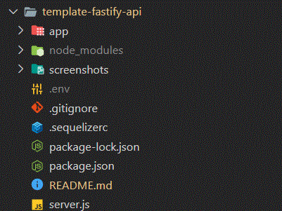
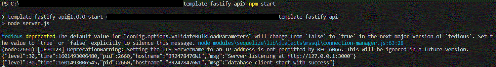
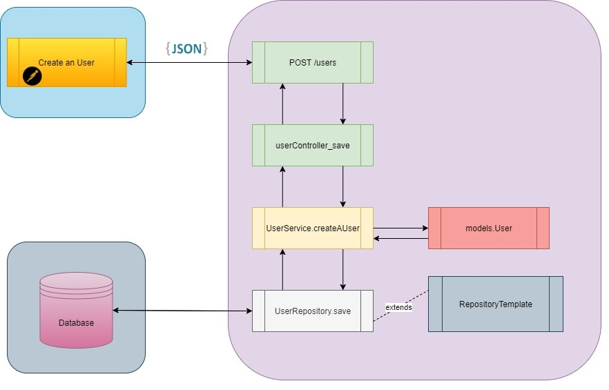
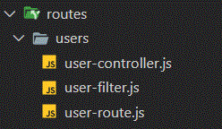
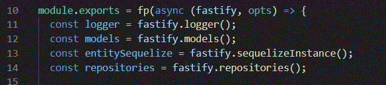

# Template Fastify Api

> This is a NodeJS application that provides the CRUD Operations exposed with an API, using the framework Fastify, Sequelize, Swagger and Security.

---

## Table of contents

- [General info](#general-info)
- [Technologies](#technologies)
- [VSCode Extensions to perform better](#vScode-extensions-to-perform-better)
- [Postman](#postman)
- [Main Structure](#main-structure)
- [Setup and how to run locally](#setup-and-how-to-run-locally)
- [(Quickly) How it works](<#(quickly)-how-it-works>)
- [(TLDR) How it works](<#(tldr)-how-it-works>)

---

## General info

The motivation of this project is to serve as a support guide for building applications using the REST API. The development architecture standard adopted is the MVC model.

---

## Technologies

- Fastify
- Sequelize v6 (with cls-hooked for transaction control)
- Sequelize-Cli
- MSSQL (Tedious)
- OpenAPI/Swagger Spec (fastify-swagger)

---

## VSCode Extensions to perform better

ESLint

Prettier - Code formatter

OpenAPI (Swagger) Editor

Swagger Viewer

YAML

---

## Postman

Import this Collection on your Postman to start use de API Client.

https://www.getpostman.com/collections/7549e8645fb91026ba1e

---

## Main Structure



## Setup and how to run locally

### Clone the repository and run:

```cmd
npm install
```

### Set environment variables OR create a file .env

The values must have the below environment variables:

```
TITLE_APP=

LOGGER_LEVEL=

DATABASE_HOST=
DATABASE_NAME=
DATABASE_USER=
DATABASE_PASSWORD=
DATABASE_POOL_MAX_CONNECTION=
DATABASE_POOL_MIN_CONNECTION=
DATABASE_POOL_IDLE=
DATABASE_ACQUIRE=
DATABASE_DIALECT=mssql
DATABASE_REQUEST_TIMEOUT=
DATABASE_ENCRYPT=true
```

> You can provide this environment variables via any other ways, like arguments via any Cloud Platform.

---

## Run with Sql Server locally via Docker

Execute the below command:

```
docker run -d -p 1433:1433 --name test-sqlserver -e "ACCEPT_EULA=Y" -e "SA_PASSWORD=Teste@123" -v mssql-local:/var/opt/mssql mcr.microsoft.com/mssql/server
```

Create the `.env` file on the root folder of the project. Configure like this:

```
TITLE_APP=Template Fastify Api

LOGGER_LEVEL=debug

DATABASE_HOST=0.0.0.0
DATABASE_NAME=
DATABASE_USER=sa
DATABASE_PASSWORD=Teste@123
DATABASE_POOL_MAX_CONNECTION=50
DATABASE_POOL_MIN_CONNECTION=10
DATABASE_POOL_IDLE=10000
DATABASE_ACQUIRE=30000
DATABASE_DIALECT=mssql
DATABASE_REQUEST_TIMEOUT=300000
DATABASE_ENCRYPT=true
```

## Once you have started the container with `MSSql`, you will be able to start your application

```
npm start
```



---

## (Quickly) How the project works

The application exposes REST services to perform CRUD operations. The Fastify is responsable to create and injects the data for reusability.

:orange_book: When Create a User, for example, the flow below is performed:

1. :green_book: The route receives the request. The controller only treats the received data, rtrieve the objects injected by the Fastify (like models, loggers, plugins), and delegates it to a Service Layer.

2. :ledger: :closed_book: The Service Layer will contain the business rules of the domain, knowing which models/repositories it will handle.

3. :notebook: The Repository Layer contains database access operations. It will contain the operation rule desired by the model.



---

## (TLDR) How it works

When we talk about Fastify, it is all about plugins! A plugin can be a small piece of your code, which becomes extensible and injectable throughout your application in a fast and modular way. And that is awesome! :metal:

[See more Fastify Plugins](https://www.fastify.io/docs/latest/Getting-Started/#your-first-plugin)

Fastify is used like Express, to serve our routes and register our middlewares.

You will see a file **index.js** in some folders (like models, services and repositories). This file is responsable to load the other files and tells to Fastify how to register on the context.

<br>

### Structure explained

### **server.js**

The **server.js** file contains the main config of project and the initial startup.

### **app**

This folder contains de main structure of our application, with the routes, models, services and repositories.

### **bootstrap.js**

The **bootstrap.js** file have the responsability of load and register all of our plugins, routes, models and any kind of plugin that we need to use on the entire application.

### **routes**

This folder contains the routes, controllers and filters.

> **When you create a folder with this files, automatically a route will be created.**

**Example of a route `users`:**



**The route `/users` will be created.**

**user-route.js**

> The file defines the route, the HTTP Methods and the controller to each route that will be handled.

**user-filter.js**

> The file only treats the request parameters and request body.

**user-controller.js**

> The file defines the handler of a request. In here, you will be able to get the injected objects from Fastify.



On the line 10, we just simply get the Fastify instance (like `app` from Express).

On the lines between 11 and 14, we get the injected plugins previously injected by the framework. For example, `fastify.models()` will return the models of sequelize.

### **services**

This layer is very important to adopt. In here, we will put all the business logic. Also here we can control our transactions (See `cls-hooked`).

```javascript
async someOperation(id, data, entitySequelize) {
    try {
        return entitySequelize.transaction((tx) => {
            return Promise.all(
                [   this.someOperation(id),
                    this.anotherOperation(data)
                ]
            );
        });
    } catch (e) {
      throw e;
    }
  }
```

> **If the `someOperation()` method returns success on the operation and the `anotherOperation()` method returns an error, ALL transaction will be rolled back.**

### **repositories**

This file contains only the operations of your specific model.

```javascript
 async findAll(filter) {
    return this._model.findAll();
  }
```

> The `this._model` reference is the model of Sequelize

### **models**

This folder contains de Sequelize Models, that will be mapped in database.

**sequelize-instance.js**

> This file create an instance of Sequelize config with the environment variables provided by **.env** OR another way.

**index.js**

> This file will map all of our models/entities that exists on the folder **models**. Also the file create a connection with database, provided by **sequelize-instance.js**.

### **plugins**

This folder contains all the plugins and other global instances that you want to use on the entire project.

### **swagger**

This folder contains the API Documentation `api-spec.yaml`, and the `index.js`, which is responsable to create de Swagger UI of our API.

[To see more OpenAPI basic structure](https://swagger.io/docs/specification/basic-structure/)

---
